<p align="center">
  
</p>

<h1 align="center">Weather display</h1>

<p align="center">
  <b>Firmware for the Waveshare ESP32-S3-Touch-AMOLED-1.75</b><br>
  Local weather, an hourly forecast and a live rain radar on a round AMOLED screen. No API keys needed.
</p>

<p align="center">
  <a href="https://github.com/TheMonkeyz/esp32-s3-weather/releases/latest"></a>
  <a href="https://github.com/TheMonkeyz/esp32-s3-weather/actions/workflows/firmware.yml"></a>
  <a href="LICENSE"></a>
</p>

<p align="center">
  <a href="https://themonkeyz.github.io/esp32-s3-weather/"><b>Install in your browser</b></a> ·
  <a href="https://github.com/TheMonkeyz/esp32-s3-weather/releases">Releases</a> ·
  <a href="CHANGELOG.md">Changelog</a> ·
  <a href="docs">Docs</a>
</p>

<table align="center">
  <tr>
    <td align="center">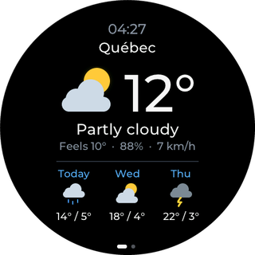<br><a href="#weather-screen"><b>Weather</b></a><br><sub>Now, the next 2 h and 3 days</sub></td>
    <td align="center">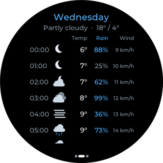<br><a href="#hourly-view"><b>Hourly view</b></a><br><sub>7 days, hour by hour</sub></td>
    <td align="center"><br><a href="#radar"><b>Radar</b></a><br><sub>Rain and lightning, 3-hour loop</sub></td>
  </tr>
  <tr>
    <td align="center">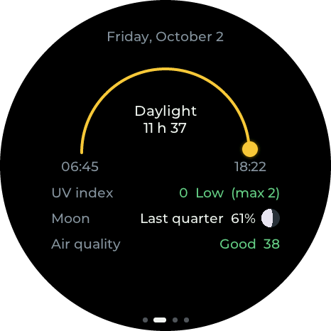<br><a href="#extras"><b>Extras</b></a><br><sub>Sun, UV, moon, air quality</sub></td>
    <td align="center">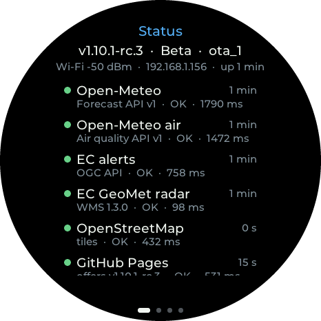<br><a href="#status"><b>Status</b></a><br><sub>Version, Wi-Fi, online services</sub></td>
    <td align="center"><br><a href="#settings-on-the-display"><b>Settings</b></a><br><sub>Long-press the weather screen</sub></td>
  </tr>
</table>

## 🧰 What you need

- A **Waveshare ESP32-S3-Touch-AMOLED-1.75**: ESP32-S3 with 16 MB flash and 8 MB PSRAM, 1.75" round AMOLED
  (466×466 CO5300 panel), CST9217 touch. The firmware also uses its two microphones (presence dimming), its speaker
  (alert sounds) and its motion sensor (wake on pick-up).
- A **USB-C data cable** and a computer with **Chrome or Edge** for the first install.
- A **Wi-Fi network** with internet access, and a **phone** for the Wi-Fi setup and the settings page. The ESP32-S3
  only has 2.4 GHz Wi-Fi.
- No accounts and no API keys. Where the data comes from, and where it's available: see
  [Data sources](#-data-sources).

## 🔌 Install

Open the **[web flasher](https://themonkeyz.github.io/esp32-s3-weather/)** in Chrome or Edge on a computer, plug in
the display with a USB-C data cable, and follow the steps. It has two channels: **Stable** (the latest release) and
**Beta** (a release candidate, offered only while it's newer than the latest release).

> [!TIP]
> Tick **Erase device** the first time. Leave it unticked for updates, to keep Wi-Fi and settings.

Other ways:

- Ready-made images are also attached to each [release](https://github.com/TheMonkeyz/esp32-s3-weather/releases).
  The release notes give the esptool commands: the full image for a first install (erases saved settings), or the
  separate parts for an update that keeps them.
- On Windows, from your own build: see [Flashing on Windows](#flashing-on-windows).
- Once installed (v1.3.0 and later), the display updates itself over Wi-Fi: see
  [Updates over Wi-Fi](#-updates-over-wi-fi).

If the computer can't find the board, hold **BOOT**, tap **RESET**, release **BOOT**, then try again.

## 📶 First-time setup

1. Flash the firmware: the [web flasher](https://themonkeyz.github.io/esp32-s3-weather/) (tick *Erase device* the
   first time; leave it unticked for updates to keep Wi-Fi and settings), or see
   [Flashing on Windows](#flashing-on-windows). With no Wi-Fi saved, the screen shows **Wi-Fi setup** and a QR code.
2. Scan the QR code to join the display's network **Weather-Setup**. Its password is shown under the code: each
   display has its own (since v1.12.0).
3. The phone's **"Sign in to network"** page opens by itself (captive portal) and shows the setup page with the Wi-Fi
   section on top. If it doesn't, open **http://192.168.4.1**.
4. The page scans automatically and lists nearby networks (strongest first, 🔒 = password needed). Tap yours, enter
   the password (**Show** reveals it while typing) and save. The display restarts and connects. **Scan again**
   refreshes the list.

### Wi-Fi without typing the password

The Wi-Fi setup screen has two pages; **swipe** to switch:

1. **Any phone:** QR code to join **Weather-Setup**; the setup page opens by itself (as above).
2. **Android 10+ — Easy Connect:** with the phone connected to the Wi-Fi you want, scan the display's code (the
   camera or any QR scanner works). The phone sends that network, password included; the display saves it and
   restarts.

Browsers can't read the Wi-Fi passwords saved on a phone, and iPhones don't do Easy Connect. For iPhone, the setup
page's *Password saved on your phone? Copy it* tip explains how to copy it: Settings → Wi-Fi → ⓘ → Password → Copy.

## 📱 Using it

The main screens sit in a row: **Status · Extras · Weather · Radar**. From the weather screen, swipe **right** for
the extras page (and right again for the status page), **left** for the radar. Tap a forecast day for the hourly
view, and long-press for Settings.

### Weather screen


Clock, city, icon and temperature, conditions, then feels-like, humidity (blue drop) and wind (wind mark). A line
says when rain or snow starts or stops within 2 h ("Rain around 14:45"). At the bottom, the 3-day high/low with
icons.

With several places, there is one page per place (dots on the right edge), each with its own local time.

- **Drag up/down** to change place. The page follows the finger, snaps, and bounces at the first and last.
- **Tap a day** of the forecast for its hourly view.
- **Swipe right** for the extras page, **left** for the radar.
- **Long-press** for the Settings screen.

<br clear="right">

### Hourly view


7 days (the weather screen shows the first 3). For each day: weekday, conditions and high/low; the day's temperature
graph (0 to 24 h, a line every hour, high and low marked; today's past hours greyed with a dot at now); then one row
per hour: time, icon, temperature, chance of rain, wind. Today starts at the current hour ("Now").

- **Drag up/down** to scroll the hours.
- **Drag left/right** to change day. The page follows the finger and snaps.
- **Tap** to close.

<br clear="right">

### Radar


The area around the location: a dimmed OpenStreetMap map, Environment Canada radar, lightning of the last
10 minutes (yellow bolts), a range ring, the clock, and the radar time and radius.

- **Tap** to play the last 3 h (15 frames, 3 fps), looping for a minute (new radar images join the loop). Tap again
  to stop.
- **Swipe down** to zoom in, **up** to zoom out: ≈25 km up to ≈1,550 km radius in 7 doubling steps, animated.
- **Swipe right** to go back.

<br clear="right">

### Extras


- Date.
- Sun arc from sunrise to sunset, with the sun at the current time (daylight length, or the next sunrise at night).
- UV index now and today's max.
- Moon phase with picture and % lit.
- Air quality (US AQI).
- Pollen when available (Open-Meteo only has it for Europe, so the row is hidden in Canada).

**Swipe left** to go back, **right** for the status page.

<br clear="right">

### Status


Swipe right twice from the weather screen.

- Firmware version, update channel and app slot.
- Wi-Fi signal, IP address and uptime.
- Every online service the display uses (Open-Meteo forecast and air quality, Environment Canada alerts and radar,
  OpenStreetMap, GitHub Pages for updates, the time server), with a coloured dot, when it was last contacted, how
  long it took, or why it failed. Opening the page checks any service not contacted in the last 5 min.

**Swipe left** to go back; drag to scroll.

<br clear="right">

### Weather alerts

Environment Canada watches, warnings, advisories and statements for the location: a pill in the alert colour
replaces the city name (`+1` if there are more). The details show a map of the affected region on OpenStreetMap,
until when, the area and the text.

**Tap the top half** of the weather screen for the details; drag to scroll; tap to close.

### Alert sounds

Warning beeps through the speaker when a new weather alert appears for the place shown: yellow 2 beeps, orange
3 + 3, red a hi-lo siren. Each alert sounds once.

Set the level (off / red / orange and red / all), the volume and quiet hours (red still sounds) on the settings page.
The level, the volume and a test are also on the display's Settings screen.

### Settings on the display


**Long-press** the weather screen.

- **Screen:** dim when quiet, wake on pick-up, timing (Short / Normal / Long), brightness.
- **Units:** temperature, wind, clock, language (English / Français / ᐃᓄᒃᑎᑐᑦ).
- **More:** the phone settings QR code, Wi-Fi network, check for updates, restart.

Tap a row to switch or change it (saved at once, same settings as the phone page). Slide along the bottom band for
brightness (it follows the finger). **Done** or swipe **right** to close. Restart needs two taps.

<br clear="right">

### Settings page on your phone

A phone-friendly page, opened from the QR code and served over HTTPS. See
[Changing settings later](#-changing-settings-later) for how to open it.

- **Location:** *Use my phone's location* (GPS), city search, or manual lat/lon.
- **Units:** °C/°F, wind in km/h, mph or m/s (miles on the radar with mph), 24- or 12-hour clock.
- **Screen & presence:** live sound meter, calibration, delays, brightness.
- **Wi-Fi network.**

### Presence dimming

The microphones act as a presence sensor: quiet room → dim → screen off. Sustained sound (not a single bang), a
touch, or picking the display up (motion sensor) → back on.

Configured on the settings page: timing, sound sensitivity, wake on pick-up (on/off, High/Normal/Low, with a live
movement meter). How it works: [Presence dimming (microphones)](#-presence-dimming-microphones).

## 🌍 Languages

The display and the settings page come in **English**, **French** (Canadian French) and **Inuktitut** (syllabics).

<table align="center">
  <tr>
    <th>English</th>
    <th>Français</th>
    <th>ᐃᓄᒃᑎᑐᑦ</th>
  </tr>
  <tr>
    <td>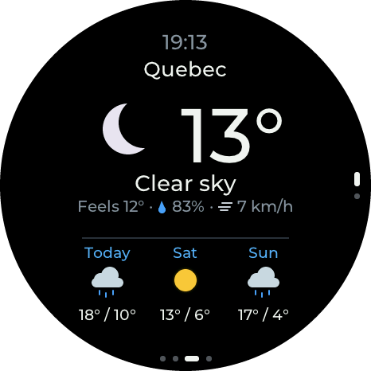</td>
    <td>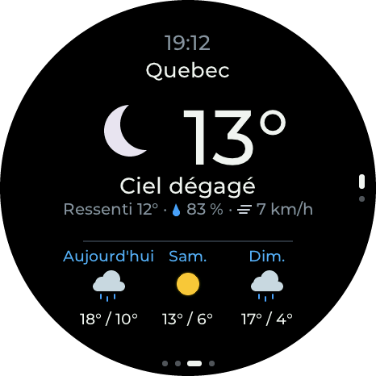</td>
    <td>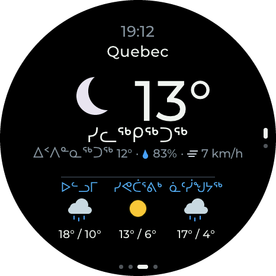</td>
  </tr>
  <tr>
    <td>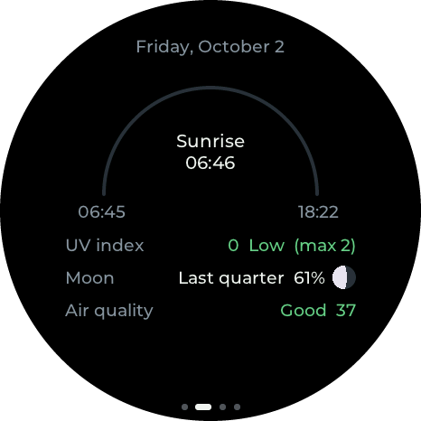</td>
    <td>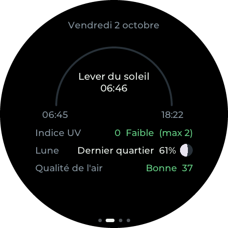</td>
    <td>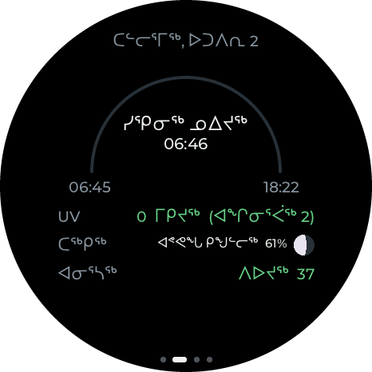</td>
  </tr>
  <tr>
    <td>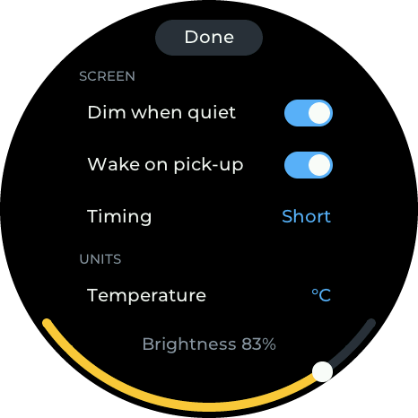</td>
    <td>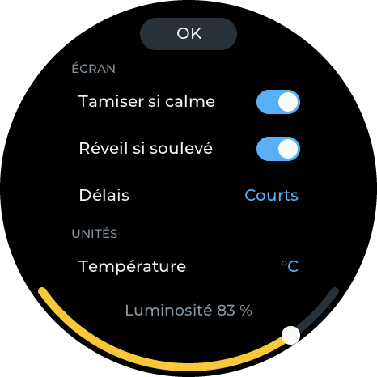</td>
    <td>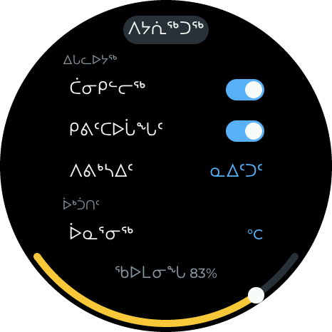</td>
  </tr>
</table>

- One choice for the display and the settings page together: the **Langue / Language** row on the display's Settings
  screen, or the selector in the page's **Units** card.
- Weather alerts come in the chosen language (Environment Canada publishes English and French; Inuktitut shows
  English). The "What's new" notes stay in English.

> [!NOTE]
> The Inuktitut text is a draft that no fluent speaker has reviewed yet, so some words may be wrong. See
> [docs/translations/](docs/translations/).

## 🔧 Changing settings later

- **Quick settings on the display:** long-press the weather screen (see
  [Settings on the display](#settings-on-the-display)). Places, the Wi-Fi password, custom timings and sound
  calibration are on the phone page.
- **Location:** long-press the weather screen, tap **More on your phone**, scan the QR code and open the page. Your
  phone must be on the same Wi-Fi. The code also carries the display's **key**: a page opened from it can change
  settings, and that phone remembers it. A page opened by typing the address shows the settings but asks you to
  scan the code before changing anything. The phone will warn that the certificate isn't trusted. That's expected, because
  the display signs its own certificate; choose *Advanced → Proceed*. HTTPS is what allows **Use my phone's
  location**. Location changes apply immediately: the map and radar reload within seconds.
- **Places:** up to 4 (home, cottage, work...), in the **Places** card of the same page. Tap a place to change it
  (name, city search, or tap the **map** / drag the pin to the exact spot, or use the phone's location), *Show* to
  put it on the display, or *＋ Add a place*. The map needs internet on the phone. On the display, drag up or down on
  the weather screen to change place. Everything follows the place shown: alerts, air quality, the hourly view,
  extras and the radar. Every place's forecast is refreshed every 10 minutes, so it appears at once; the radar map is
  cached for the first place only, so other places' maps load in a few seconds.
- **Language:** English, French or Inuktitut; see [Languages](#-languages).
- **Units:** on the same page, the **Units** card: temperature (°C/°F), wind (km/h, mph, m/s; the radar's distances
  follow: miles with mph, km otherwise) and clock (24-hour or 12-hour). The display redraws at once.
- **Wi-Fi:** long-press the weather screen, then tap **Wi-Fi network**. The display starts **Weather-Setup**
  alongside its current connection and shows a QR code to join it. The sign-in page then opens on the phone as
  during first-time setup. Tap the display to cancel; the setup network also switches off after 10 min. When the
  display is offline, the first long-press goes straight to the Wi-Fi setup QR code.
- **When the saved network can't be reached** (new place, new router, router still starting after a power cut):
  - While it says *Connecting to …* or *Fetching forecast…*, a **long-press** starts the setup network and shows its
    QR code.
  - After about 30 s without a connection it shows the setup QR code by itself (*Can't reach … / Tap to try again*),
    for 15 minutes. After that (a long outage) it stops opening the setup network by itself and just keeps trying the
    saved one (*Still trying*); a long-press still opens setup.
  - While the setup screen is open, the display doesn't try the saved network: that would get in the way of the
    phone. Tap the screen to try the saved network again (30 s), or wait: after 5 minutes without a phone on the
    setup network it tries again by itself, then shows the setup screen again. If you save a new network instead, it
    restarts and joins that one.
- **Reset Wi-Fi from the buttons** (rarely needed now): press **RESET**, then hold **BOOT** for about 2 s while the
  screen says *Starting…*. Don't hold BOOT *while* pressing RESET, because that puts the chip into flashing mode.

## 🌙 Presence dimming (microphones)

The two onboard microphones measure the room's sound level every 0.1 s.

- **Quiet** for *Dim after* → the screen dims. Quiet for *Turn off after* (total quiet time) → the screen turns off.
- **Waking** from dim/off needs *Wake after* seconds of **sustained** sound. Sound fills a wake meter and silence
  drains it at half speed, so talking with pauses wakes it but a door slam doesn't. Touching the screen always wakes
  it; the touch that wakes a dark screen is ignored, so it doesn't also swipe or tap.
- **Calibrate** on the settings page while the room is quiet: 5 s of measurement set the background level (90th
  percentile). "Loud" means background + *Sensitivity* dB.
- The settings card shows a live meter (orange mark = trigger level), the state (Active / Dimmed / Screen off), the
  wake progress and the quiet timer, which is handy for tuning.
- **Presets** (durations can be entered in s / min / h; editing any value switches to *Custom*):

  | Preset | Dim after | Turn off after (total quiet) | Wake after |
  |---|---|---|---|
  | Testing | 10 s | 30 s | 2 s |
  | Short | 2 min | 15 min | 2 s |
  | **Normal** (default) | 10 min | 60 min | 3 s |
  | Long | 30 min | 3 h | 3 s |

  Other defaults: sensitivity 10 dB, brightness 100% / dimmed 15%. Defaults only apply when nothing is saved in NVS.

## 🔄 Updates over Wi-Fi

From **v1.3.0**, the display updates itself from the [web flasher site](https://themonkeyz.github.io/esp32-s3-weather/):

- It checks a minute after starting and then every 6 hours. When a newer version exists, a blue **Update vX.Y.Z**
  pill appears at the bottom of the weather screen. Tap it to see **what's new** since your version, then
  **Install**. It downloads, restarts, and keeps all settings. Nothing installs without you asking.
- The settings page has a **Firmware** card: installed version, **Updates: Stable releases / Beta (release
  candidates)**, *Check for updates*, what's new, and *Install*, with a progress bar.
- **Beta** follows the flasher's Beta channel (`vX.Y.Z-rc.N` tags) and falls back to Stable when there's no newer
  release candidate.
- Safety: the download is checked for integrity (image header, SHA-256) and must be this project's firmware, at the
  version that was offered, before it's selected. It comes over HTTPS from the project's GitHub Pages site; it isn't
  signed (see [Security notes](#-security-notes)). A new version is kept once it has run for a minute connected to
  Wi-Fi (ten minutes without Wi-Fi); if it restarts before that (crash, boot loop, power cut), the display goes back
  to the previous version by itself and says so on its update screen. A restart asked for during that minute waits
  for it.
- **Coming from v1.2.0 or earlier:** flash v1.3.0+ once over USB (web flasher, *Erase device* unticked; settings are
  kept). It switches to a flash layout with two firmware slots; the stored radar maps download again.

What changed in each version: [CHANGELOG.md](CHANGELOG.md).

## 🌐 Data sources

- Alerts: Environment Canada, [MSC GeoMet OGC API](https://api.weather.gc.ca) `weather-alerts` collection.
- Weather: [Open-Meteo](https://open-meteo.com) (current conditions, 7-day daily and hourly forecast,
  `timezone=auto`).
- Radar: [ECCC MSC GeoMet](https://eccc-msc.github.io/open-data/msc-data/obs_radar/readme_radar_geomet_en/) WMS,
  layer `RADAR_1KM_RRAI` (Canada and the northern US border region, 1 km, every 6 min, last 3 h).
- Lightning: same service, layer `Lightning_2.5km_Density` (Canadian Lightning Detection Network, 2.5 km, every
  10 min, last 3 h, Canada and up to 250 km beyond). Each radar frame shows the flashes of its 10-minute window.
- Basemap: OpenStreetMap standard tiles (zoom 4–10, one level per radar zoom step). After boot, any level that isn't
  cached yet downloads in the background (about 45 s for all 7) and is saved in flash, so zooming is instant
  afterwards. If you open the radar before it's done, a "Preparing maps" panel shows the progress. Attribution is
  shown on screen.

In short: the forecast works anywhere in the world; the radar covers Canada and the northern US border region;
weather alerts and lightning cover Canada (lightning up to about 250 km beyond).

## 💻 For developers

Built with **ESP-IDF v5.5.4** (the version CI uses) and **LVGL 9.2.2**. How the pieces fit together:
[docs/ARCHITECTURE.md](docs/ARCHITECTURE.md). How changes are tested on the board: [docs/TESTING.md](docs/TESTING.md).

### Flashing on Windows

The prebuilt binaries go in `firmware/` (they're ignored by git, so you get them from a build). The flashing tool is
`tools/esptool.exe`: standalone esptool **v4.8.1**, downloaded from
https://github.com/espressif/esptool/releases (`esptool-v4.8.1-win64.zip`) and also ignored by git.

Flash layout: bootloader at `0x0`, partition table at `0x8000`, app at `0x10000`, OTA data
(`ota_data_initial.bin`) at `0x610000`. Flash settings: DIO, 80 MHz, 16 MB.

<details>
<summary><b>flash.bat, monitor.ps1 and the flash helper</b></summary>

- `flash.bat`: flashes `firmware\*.bin` (COM port auto-detected), then logs serial output to `serial_log.txt`.
  - `flash.bat`: interactive, logs for 40 s, then waits for a key press.
  - `flash.bat auto 90`: no pause at the end (for scripts or Claude Code), logs for 90 s.
- `monitor.ps1 -Port COM5 -Seconds 60`: serial log only. Press Q or Esc (or create `stop.request`) to stop early.
- `start_flash_helper.bat`: opens the **flash helper** window (`flash_helper.ps1`). Whenever a file named
  `flash.request` appears in this folder, it flashes `firmware\*.bin` and logs serial output for the number of
  seconds written in the file (default 60). This lets tools that can only write files (like the Claude desktop app)
  trigger a flash. The window shows each step live: the request, the esptool upload, **FLASH OK on COMx in N s**
  (with a beep) or **FLASH FAILED** with the last esptool lines, the board's serial output, and a summary (errors,
  warnings, resets). It also writes:
  - `flash.status`: `idle`, `flashing`, `logging` or `flash_failed`.
  - `flash.done`: exit code, port, timings and counts (`stopped_early=1` if the log was cut short).
  - `flash_helper.log`: a running history.

  To end the serial log before its time is up, press **Q** or **Esc** in the window, or create a file named
  `stop.request` (`echo > stop.request`). The log so far is saved and the helper waits for the next request.
  Close the window to stop the helper itself.

</details>

### Diagnostics

`echo 300 > reboot.request` restarts the board through the helper without flashing and records 300 s of log;
`python3 tools/diag_summary.py` then summarises memory, render timing and per-task CPU/stack. Details and
reference numbers: [docs/DIAGNOSTICS.md](docs/DIAGNOSTICS.md). The whole test routine (test builds, flash helper,
logs, screenshots with `tools/snapshot.py`) is in [docs/TESTING.md](docs/TESTING.md).

### Web flasher and automatic builds (GitHub Actions)

The [web flasher](https://themonkeyz.github.io/esp32-s3-weather/) has two channels, like capsule-radar's board
picker: **Stable** (the latest release) and **Beta** (a release candidate, offered only while it's newer than the
latest release). `?channel=beta` in the address preselects Beta.

`.github/workflows/firmware.yml` builds the firmware with ESP-IDF v5.5.4 on every push and pull request, but only
tags publish anything, and the flasher is assembled from the files attached to the releases, so people install
exactly what was released.

| Event | What happens |
|---|---|
| push to `main`, pull request | build only (compile check); the images are kept as a workflow artifact for testing |
| tag `vX.Y.Z-rc.N` (anything with a `-`) | GitHub **pre-release**; the flasher's **Beta** channel moves to it |
| tag `vX.Y.Z` | GitHub Release; the flasher's **Stable** channel moves to it (and Beta disappears until the next candidate) |
| *Run workflow* on `main` | rebuilds the flasher from the existing releases (after editing `web/flash/index.html`) |

<details>
<summary><b>Releasing a new version, release files, the flasher site and GitHub setup</b></summary>

Releasing a new version: first add a section to [`CHANGELOG.md`](CHANGELOG.md) (`## vX.Y.Z - YYYY-MM-DD`, one
`- ` line per change, written for the person holding the display) and commit it. The display shows the sections
between its version and the offered one before installing.

```
git tag -a v1.1.0-rc.1 -m "Release candidate"      # optional: test it from the Beta channel first
git push origin main v1.1.0-rc.1
git tag -a v1.1.0 -m "What's new"                  # same commit once it's good
git push origin v1.1.0
```

- The version is `git describe --tags --always` (e.g. `v1.0.0`, `v1.0.0-3-g1a2b3c4` or just a commit hash before
  the first tag). CI writes it to `version.txt`, which ESP-IDF uses as the app version. It appears in the boot log
  (`diag: firmware …`), at the bottom of the settings page and on the flasher page.
- Release assets: `bootloader.bin`, `partition-table.bin`, `ota_data_initial.bin`, `weather_amoled-<version>.bin`
  (updates keep settings), `weather_amoled-<version>-full.bin` (merged, flash at 0x0; erases settings) and
  `flash-parts.json` (offsets and version, used to build the flasher). v1.0.0 predates `flash-parts.json`; the site
  builder falls back to the standard file names and offsets for it.
- The flasher page is `web/flash/index.html` ([ESP Web Tools](https://esphome.github.io/esp-web-tools/)).
  `tools/make_flasher_site.py` has two steps: `dist` turns a build into release files, `site` assembles the page
  with `stable/` and `beta/` folders (each with its images and an ESP Web Tools `manifest.json`), `channels.json`,
  which the page reads for the picker, `notes.json` (the 15 newest `CHANGELOG.md` sections, plain text, shown on the
  display before an update and on the page for the selected version), and `fonts/` (the display's Montserrat font
  from `main/`, so the page matches the display). The pictures are in `web/flash/img/`. The
  images are separate parts (bootloader 0x0, partition table 0x8000, app 0x10000, OTA data 0x610000) so an update
  doesn't wipe NVS (Wi-Fi, location, settings, TLS certificate); a merged image would.
- One-time setup on GitHub: **Settings → Pages → Build and deployment → Source: GitHub Actions**, and
  **Settings → Environments → github-pages → Deployment branches and tags → Add deployment branch or tag rule →
  Tag, `v*`** (by default only `main` may deploy to Pages, which would make releases fail at the Pages step).
- Preview locally after a build: `python3 tools/make_flasher_site.py dist && python3 tools/make_flasher_site.py site
  --stable dist`, then `python3 -m http.server -d _site 8000` and open http://localhost:8000 (Web Serial works on
  localhost).

</details>

### Building from source

With an ESP-IDF **v5.5.4** environment (on Windows, the ESP-IDF PowerShell shortcut, or
`. C:\Espressif\esp-idf\export.ps1` in PowerShell):

```powershell
idf.py set-target esp32s3
idf.py build
idf.py -p COM5 flash monitor
```

LVGL 9.2.2 and esp_codec_dev are fetched automatically by the component manager (`main/idf_component.yml`). To
refresh the prebuilt files used by `flash.bat`, copy `build\bootloader\bootloader.bin`,
`build\partition_table\partition-table.bin`, `build\ota_data_initial.bin` and `build\weather_amoled.bin` into
`firmware\`.

### Project layout

<details>
<summary><b>Where everything is</b></summary>

```
main/
  main.c        boot flow, weather refresh loop, reacts to location changes
  display.c     CO5300 QSPI panel driver + LVGL display port (flush, rounder, LVGL task + mutex, raw frames)
  touch.c       CST9217 I2C touch -> LVGL pointer
  ui.c          weather screen, hourly view, message/QR screens, settings overlay, swipe handling
  slide.c       moves between screens, places and days, and list scrolls, drawn from pictures (follow the finger, ~60 fps)
  pager.c       full-screen pages (places, days)
  png_rows.c    row-by-row PNG decoding with the ROM's inflate (radar frames, lightning, map tiles)
  radar.c       radar screen: basemap tiles + flash cache, GeoMet frames, animation
  weather.c     Open-Meteo fetch/parse, WMO code -> text/icon
  alerts.c      Environment Canada weather alerts (MSC GeoMet OGC API)
  net.c         Wi-Fi station, setup access point + captive portal (DNS, DHCP option 114), credentials in NVS
  web.c         settings server: HTTPS on the home network, plain-HTTP captive portal on the setup AP, JSON API
  config.c      saved location (NVS) and local-time helper (UTC offset from Open-Meteo)
  presence.c    microphones (ES7210 over I2S) -> presence state machine -> screen brightness
  imu.c         QMI8658 motion sensor (wake on pick-up)
  sound.c       alert beeps through the speaker (ES8311, shares I2S with the microphones)
  ota.c         updates over Wi-Fi: download, checks, rollback
  i18n.c        display language; i18n_strings.h = every display text in English, French and Inuktitut
  svc.c         health of the external services (last result per service) + checks run from the status page
  diag.c        "diag:" log lines: heap, frame timing, lock contention, CPU/stack per task, render bench
  testcon.c     test console on USB (simulated touches, Wi-Fi test switches) for tools/harness
  lvgl_mem.c    LVGL's allocator, in PSRAM (keeps internal RAM for Wi-Fi, DMA and stacks)
  web/index.html  settings page (embedded)
  tlscert.c     per-device TLS certificate: generated on first boot, stored in NVS (see Security)
  montserrat.ttf  font, rendered at runtime with LVGL TinyTTF (supports accents like "é"); montserrat-OFL.txt = its license
  syllabics.ttf   Noto Sans Canadian Aboriginal, subset to the syllabics (Inuktitut); syllabics-OFL.txt = its license
partitions.csv  nvs, phy, ota_0 + ota_1 (3 MB each), otadata, mapcache (4 MB: one 512 KB basemap slot per zoom level)
sdkconfig.defaults
components/dns_server/  captive-portal DNS (from the ESP-IDF captive_portal example, CC0)
docs/ARCHITECTURE.md  how the pieces fit together, memory budget, known issues
docs/DIAGNOSTICS.md   how to measure memory/CPU/render speed, reference numbers, findings
docs/TESTING.md       how changes are tested on the board: test builds, flash helper, logs, screenshots
docs/IDEAS.md         feature ideas / backlog
docs/HISTORY.md       how the project grew, how the work is done, lessons and open threads (start here)
docs/translations/    Inuktitut draft: iu.tsv (the source) and the review sheet
docs/img/hero.png     the picture at the top of this README (tools/make_hero.js)
tools/diag_summary.py summarises the diag: lines of serial_log.txt
tools/snapshot.py     saves a screen as PNG, rendered by the device (GET /api/snapshot); see docs/TESTING.md
tools/round_shots.py  turns harness or snapshot.py screens into round pictures with transparent corners (web/flash/img/)
tools/make_hero.js    builds docs/img/hero.png from those pictures (Playwright, from tools/webtest)
tools/i18n_iu.py      Inuktitut: docs/translations/iu.tsv -> display and page texts, review sheet
tools/webtest/        Playwright tests of the settings page against a mock display (npm test); see docs/TESTING.md
tools/harness/        the whole display tested without a person (screens, page, speed, Wi-Fi setup); see docs/TESTING.md
tools/make_flasher_site.py  release files (dist) and the web-flasher site with Stable/Beta channels (site)
web/flash/            web flasher page (ESP Web Tools) + screenshots
web/flash/img/        screenshots of the screens, used by the flasher page and this README
.github/workflows/firmware.yml  CI: build, GitHub Pages flasher, releases
flash_helper.ps1      flash.request = flash + log, reboot.request = restart + log (no flashing)
CLAUDE.md       notes for AI-assisted development sessions
```

</details>

## 🔒 Security notes

- **Who can change settings.** The settings page shows the settings to anyone on your Wi-Fi, but changing them
  (places, units, sound, presence, the saved Wi-Fi network, updates) needs the display's **key**, which only the
  settings QR code on the display carries: being able to see the display is the permission. The key is random,
  made on each board at its first start. The API answers changes only over HTTPS on your network, only to requests
  that name the display itself (no DNS rebinding) and only as JSON with the key header, which a web page from
  another site can't send. Before v1.12.0 anyone on the network could change everything, the saved Wi-Fi included.
- **The setup network** (*Weather-Setup*) has a password of its own on each display, shown on the display, and uses
  WPA2/WPA3. On it no key is needed (seeing the password is the permission), but it doesn't hand out the places'
  coordinates, the saved network's name or screenshots. It opens by itself for 15 minutes when the saved network is
  unreachable, then only on a long-press.
- **Updates** come over HTTPS from the project's GitHub Pages site, checked for integrity (SHA-256) and project
  name, but not signed: whoever controls the GitHub account can publish firmware, so keep two-factor
  authentication on it.
- The settings page's TLS certificate is **generated on each board** at first boot (EC P-256, self-signed, valid
  to 2099) and kept in NVS (unencrypted, as are the Wi-Fi password and the key: anyone with the board and a USB
  cable can read them). Browsers warn once because it's self-signed; the certificate name includes the end of the
  board's MAC address. Erasing the flash creates a new one (accept the warning again).
- Very early versions embedded a shared test key from `main/certs/`; no release used it, and it remains only in the
  git history of the first commit.

## 📄 License

MIT, © 2026 Laurent Mathieu. See [LICENSE](LICENSE).
The Montserrat font is under the SIL Open Font License ([`main/montserrat-OFL.txt`](main/montserrat-OFL.txt)), and
so is the syllabics font ([`main/syllabics-OFL.txt`](main/syllabics-OFL.txt)); other bundled and downloaded
components keep their own licenses, listed in [THIRD_PARTY_NOTICES.md](THIRD_PARTY_NOTICES.md).
